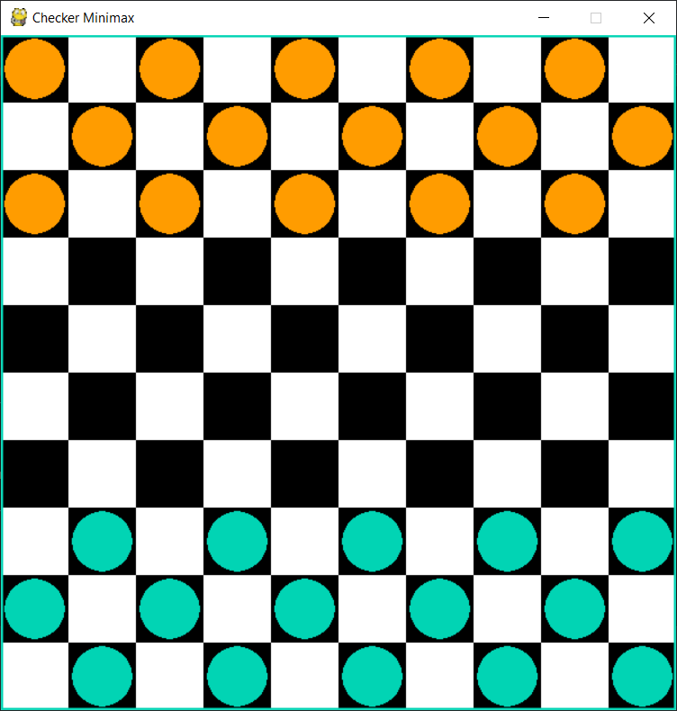
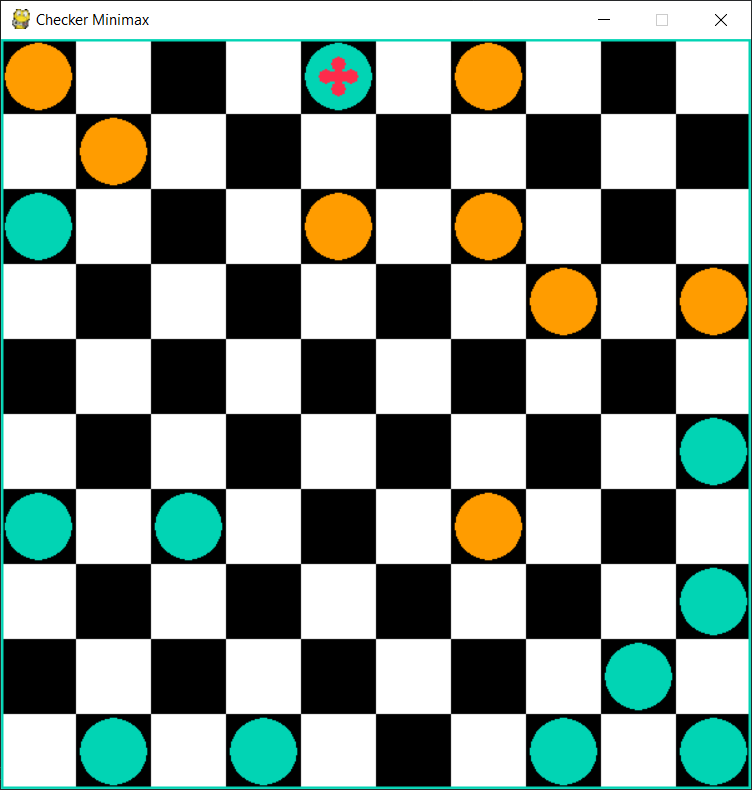

#Group members 
Umer qureshi  22K-4706
adeen ali     22K-4679
arsalan       22K-4694
umaima abeer  22K_4738

#demo video link:
https://youtu.be/jtCenuWJSvg

# Checkers AI using Minimax Algorithm

This project is a Python implementation of the classic game of *Checkers* using the Pygame library. It follows the rules of **International Draughts**, played on a 10x10 board. The opponent AI is powered by the **Minimax algorithm**, with a custom evaluation function to score and assess the favorability of each board state.

---

## 🎯 Project Objective

The aim is to explore how effective the Minimax algorithm can be in a strategic two-player game like Checkers, using only basic knowledge of tactics and without advanced AI techniques like Alpha-Beta pruning. The evaluation function was built from scratch without referencing existing implementations to create a unique learning experience.

---

## 🧠 How the Minimax Algorithm Works

Minimax assumes a rational opponent who always tries to minimize your advantage. The decision tree is built turn-by-turn:

- **Your move**: all possible moves create new branches (board states).
- **Opponent’s move**: for each of your potential moves, the opponent responds, growing the tree further.

At the **leaf nodes** (deepest level of the tree), the evaluation function assigns a score:

- Good for you → higher score
- Bad for you → lower score

Then, using backtracking:
- At the opponent's level: choose the **minimum** score (they're minimizing your advantage).
- At your level: choose the **maximum** score.

This recursive logic continues up to the root (current board), selecting the move that leads to the most favorable predicted outcome.


---

## 🧮 Evaluation Function Design

### Key Considerations:
- A deeper decision tree offers smarter AI but increases computation time.
- A high-quality evaluation function can estimate the value of non-final game states.

### Scoring Logic:

#### 🔚 Final State:
- Win → **+1500**
- Loss → **–1500**

#### 🔁 Non-Final State:
Initialize score = 0 and adjust based on board attributes.

#### ✅ AI Player (Rewards):

| Feature                               | Score Formula                         |
|--------------------------------------|----------------------------------------|
| Each **king**                        | +120                                   |
| Each **regular piece**               | +30                                    |
| Closer to promotion row (bottom)     | + (y_coord / 10) * 15                  |
| Closer to center (board control)     | + (1 - (0.5 / abs(x_coord - 5.5))) * 25|

#### ❌ Opponent (Penalties):

| Feature                               | Score Formula                          |
|--------------------------------------|----------------------------------------|
| Each **king**                        | –120                                   |
| Each **regular piece**               | –30                                    |
| Closer to promotion row (top)        | – ((10 - y_coord) / 10) * 15           |
| Closer to center (board control)     | – (1 - (0.5 / abs(x_coord - 5.5))) * 25|

> 📝 This heuristic values positional strength, piece importance, and movement potential. It does **not** yet account for formations, forced captures, or multi-jump traps.

---

## 📦 Features

- ✅ Full implementation of International Draughts rules
- ✅ Turn-based gameplay with AI opponent
- ✅ AI powered by Minimax algorithm (no pruning)
- ✅ Custom state evaluation function
- ✅ Visual gameplay using Pygame

---

## 🚀 Future Improvements

- Add **Alpha-Beta pruning** to optimize performance.
- Improve evaluation function with pattern recognition (e.g., formations).
- Add difficulty levels (vary tree depth).
- Track game history and visualize decision-making.

---

## 🖼️ Gameplay Demo

> (Insert gameplay screenshot here if available)

---

## 🛠️ Requirements

- Python 3.x
- Pygame

```bash
pip install pygame


## Screenshots:


